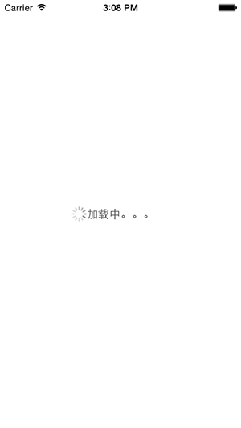
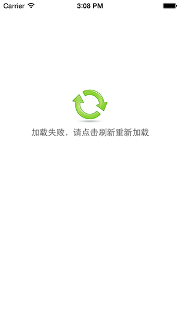

KKLoadingView
=============

loadingView and loadingErrorView

### KKLoadingView 使用





可用api

```objective-c
/**
 *  设置loading 文本；
 */
@property (nonatomic,strong)NSString *loadingText;

/**
 *  设置loading 背景颜色，默认为 whiteColor
 */
@property (nonatomic,strong)UIColor *loadingBackColor;

/**
 *  设置loading 背景图片，默认为 nil
 */
@property (nonatomic,strong)UIImage *loadingBackImage;

/**
 *  设置loading 文本颜色，默认为 darkGrayColor
 */
@property (nonatomic,strong)UIColor *loadingTextColor;

/**
 *  设置loading 指示器颜色，默认为 grayColor
 */
@property (nonatomic,strong)UIColor *loadingActivityColor;

/**
 *  隐藏并删除loadingView
 */
- (void)hideAndRemove;
```

使用 Demo

```objective-c
    KKLoadingView *loadView = [[KKLoadingView alloc]init];
    loadView.loadingText = @"加载中。。。";
    //loadView.loadingBackImage = [UIImage imageNamed:@"loadBackTest.png"];
    [self.view addSubview:loadView];
    
    self.view.backgroundColor = [UIColor grayColor];

```


### KKLoadingErrorView 使用

可用api


```objective-c
/**
 *  设置 显示文本，支持UILabel的属性
 */
@property (nonatomic,readonly)UILabel *errorLabel;

/**
 *  设置 显示图片，UIImage
 */
@property (nonatomic,strong)UIImage *errorImage;

/**
 *  错误处理,如刷新操作
 */
@property (nonatomic,copy)KKErrorBlock errorHandle;

/**
 *  隐藏并删除
 */
- (void)hideAndRemove;

```

demo

```objective-c
    KKLoadingErrorView *loadViewError = [KKLoadingErrorView new];
    loadViewError.errorImage = [UIImage imageNamed:@"refresh56.png"];
    loadViewError.errorHandle = ^{
        NSLog(@"line<%d> %s",__LINE__,__func__);
    };
    [self.view addSubview:loadViewError];
    
    dispatch_after(dispatch_time(DISPATCH_TIME_NOW, (int64_t)(3 * NSEC_PER_SEC)), dispatch_get_main_queue(), ^{
        
        //[loadViewError hideAndRemove];
        
    });

```

### 反馈

`dev.keke@gmail.com`
